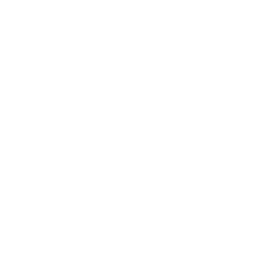

  

# The Neve Programming Language

Neve is a type-safe, **dreamy** programming language that 
makes your code predictable and fun to work with.

## Development

Currently, Neve is being rewritten from its [previous 
Python implementation](https://github.com/neve-lang/nevec-py-archive)
to a more robust Kotlin implementation.  We still have 
the following tasks to complete before the new Kotlin 
implementation is fully compliant with the previous 
Python one:

- [ ] Implement the optimization phase.
- [ ] Implement the register allocation phase.
- [ ] Output `.geadasm` human-readable bytecode.
- [ ] Implement the `geadasm` textual bytecode assembler—should be its own project.
- [ ] Test the new implementation.

Once these four tasks are complete, we will take a significant
leap in Neve’s design—that is, **adding support for native 
compilation using LLVM**.  

Similarly to OCaml, Neve will still provide a VM interpreter for `.geada` bytecode,
which will be invaluable for development environments and a more seamless debugging experience.
However, a project’s final version may be compiled into a native binary, leveraging the LLVM 
toolchain.

Users will still have the choice to opt out of the native compilation for their projects, in
case they intend their program to run on the Neve VM regardless.